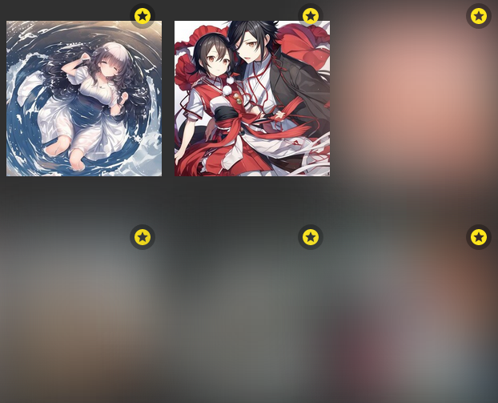

# About AIClient

Recently Sankaku Complex developers released feature to generate posts by
usage of neural networks. So AIClient is responsible for managing API requests
to AI-related content.

### Note

> Because AI is feature for premium users, AI client look a bit poor.

## Browsing posts with AIClient

For non-premium users there is restriction to directly view posts created by
AI:



But this restriction can be circumvented by sending requests directly via API.

Here is example of post browsing, using AIClient:

```python linenums="1"
import asyncio
from sankaku.clients import AIClient
from sankaku import types

async def main():
    client = AIClient()
    ai_posts = []

    async for post in client.browse_ai_posts():
        if post.rating is types.Rating.SAFE:  # Filter nsfw content
            ai_posts.append(post)
        if len(ai_posts) >= 10:  # For instance, we need to fetch 10 posts
            break
    
    print("\n".join(post.file_url for post in ai_posts if post.file_url))

asyncio.run(main())
```

## Getting specific AI post

If there is situation when you know ID of the post and want to fetch its data
from server, you can do it like this:

```python linenums="1"
import asyncio
from sankaku.clients import AIClient

async def main():
    post_id: int = 23432  # Here the ID of the post you interested in
    client = AIClient()
    post = await client.get_ai_post(post_id)
    print(post.file_url)

asyncio.run(main())
```